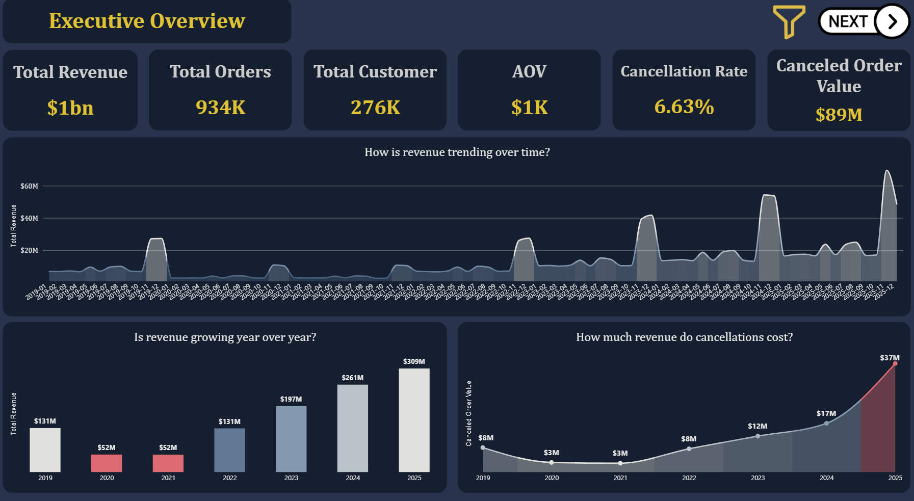
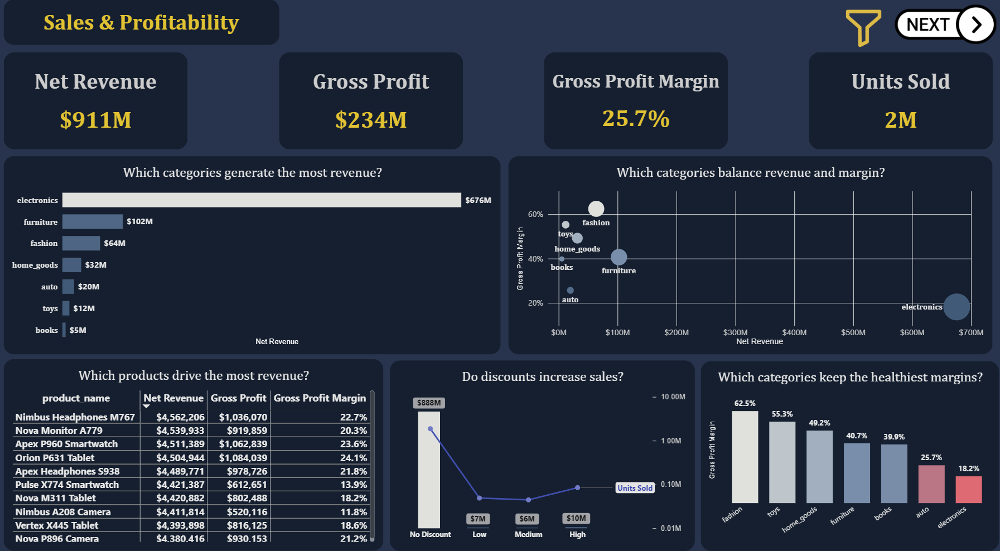
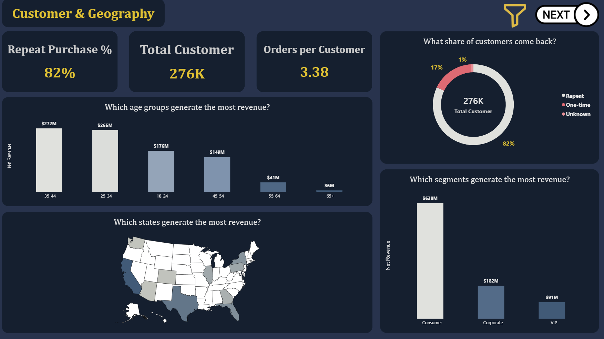
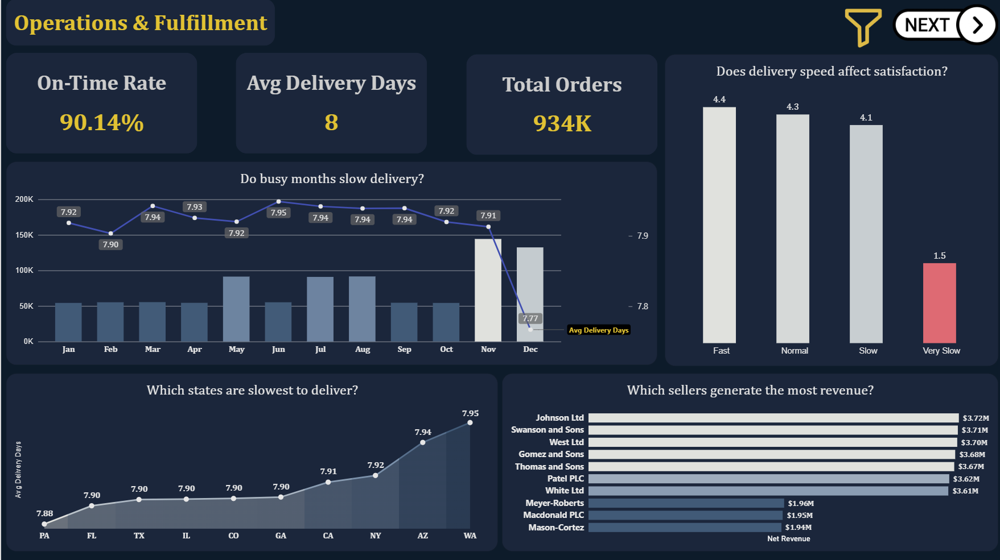
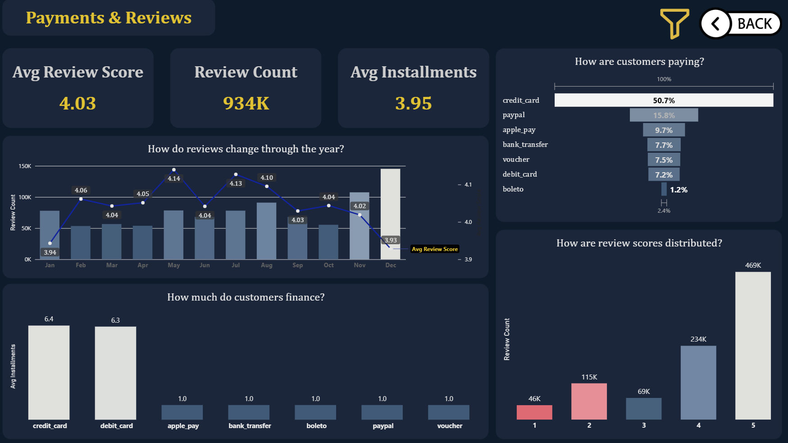
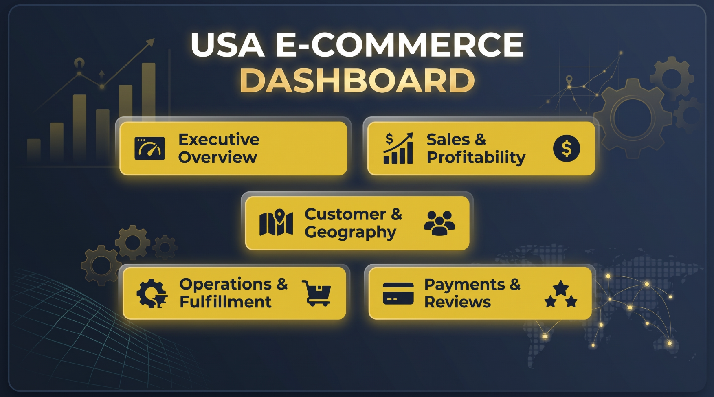
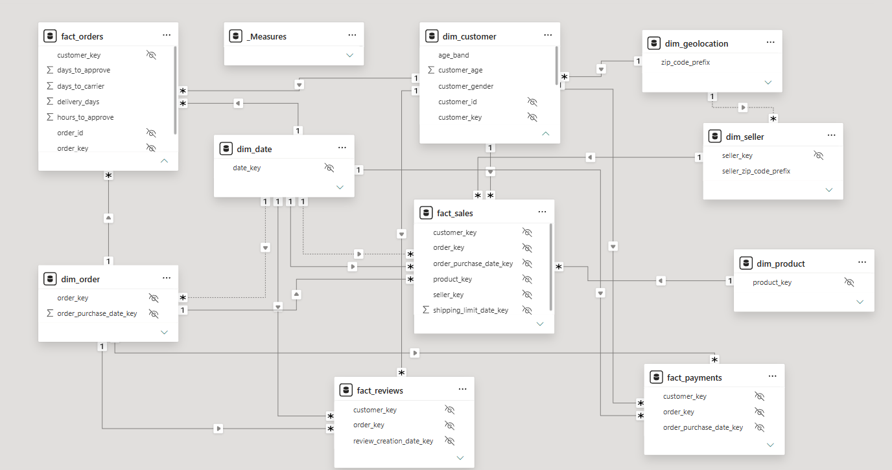

# US E-Commerce Analytics

> **Every data project produces numbers. But are those numbers actually correct?**

**End-to-End Data Warehouse & Power BI Analytics Project**

`SQL Server` `T-SQL` `Power BI` `DAX` `Git`

[⬇ Power BI report (.pbix)](https://github.com/zeyad902/us-ecommerce-analytics/releases/tag/v1.0-project) · [⬇ Dataset](https://github.com/zeyad902/us-ecommerce-analytics/releases/tag/v1.0-data) · [📖 Full documentation](docs/PROJECT_DOCUMENTATION.pdf) · [🗂 Data model](powerbi/data_model.png)

---

## Dashboard Preview



| | |
|---|---|
|  |  |
|  |  |


*Report home page — the navigation hub for the five-page workflow.*

[View the complete Power BI report](https://github.com/zeyad902/us-ecommerce-analytics/releases/tag/v1.0-project)

---

## Project Overview

I built an end-to-end analytics solution over **1M e-commerce orders**, transforming raw transactional data into a validated SQL Server warehouse and a five-page Power BI dashboard. The analysis focuses on revenue, profitability, customer behavior, fulfillment, payments, and seasonality. The full technical detail lives in the [project documentation](docs/PROJECT_DOCUMENTATION.pdf) — this README walks the story from business questions to verified insights.

---

## Business Questions

The analysis was scoped around the questions the business actually needs answered:

- Which categories and products drive revenue — and which actually earn **margin**, not just sales?
- Do **discounts** increase sales, or only pressure profit?
- What share of customers **come back**, and where should growth come from?
- Which **age groups, segments, and states** generate revenue?
- Does **delivery speed** relate to customer satisfaction — and where is the SLA threshold?
- How much revenue do **cancellations** cost, and is the problem growing?
- How do customers **pay and finance**, and what does that mean for payment strategy?
- Which months must **capacity and inventory planning** account for?

---

## What I Built

```text
Raw Data (8 CSV extracts)
   ↓
SQL Server
Bronze → Silver → Gold
   ↓
Kimball Fact Constellation
   ↓
Power BI Semantic Model
   ↓
Business Analysis & 5-Page Dashboard
```

- Designed and built a **fully scripted, re-runnable SQL Server warehouse** — from raw landing through a Kimball fact constellation
- Modeled **four fact grains around six conformed dimensions**, with a hub dimension that keeps every measure on one clean filter path
- Built an **80-check validation suite** that gates every dashboard refresh
- Designed the **Power BI semantic model** and wrote **24 DAX measures** with locked definitions reconciled to SQL
- Analyzed revenue, margin mix, retention, delivery, payments, and seasonality into **12 verified insights**
- Developed the **five-page dashboard**, where every visual is titled as the business question it answers

---

## Data Model



- **4 fact tables, 6 conformed dimensions** — a Kimball-style fact constellation
- A **`dim_order` hub** routes cross-process questions through one dimension instead of fact-to-fact joins
- **One role-playing date dimension** serves five date types; delivery bands and on-time flags are computed once in the model
- **18 relationships, all single-direction** (3 intentionally inactive) — no ambiguous filter paths in Power BI

---

## Key Business Insights

### One category dominates revenue at the thinnest margin

**Finding:** Electronics generates $676M — **74% of $911M net revenue** — at an **18.2% margin**, the lowest of all seven categories (fashion earns 62.5% on 7% of revenue).

**Business meaning:** Revenue concentration masks a profitability problem. The blended 25.7% margin is a weighted average dominated by the weakest-margin category — pricing and procurement in electronics is the largest single margin lever.

### Delivery speed is strongly associated with customer satisfaction

**Finding:** Average review scores hold at **4.4 / 4.3 / 4.1** for Fast / Normal / Slow deliveries, then collapse to **1.5/5** for Very Slow deliveries (15+ days, ~66K orders).

**Business meaning:** The pattern marks ~14 days as a natural SLA threshold. The analysis shows a strong association; investigating the operational causes of the very-slow cohort is the logical next step.

### Retention is near-ceiling — growth is an acquisition problem

**Finding:** **82.1%** of delivered customers (226,611 of 276,017) placed two or more delivered orders, averaging 3.38 orders per customer.

**Business meaning:** Loyalty programs have little headroom. The ~49K one-time buyers are the conversion pool, and net-new growth has to come from acquisition.

### November is a recurring, growing super-peak

**Finding:** November revenue spikes recur every year and grow — **$27M → $65M** between 2019 and 2025 — with November order volume 2–3× a typical month. December recorded the **fastest average delivery time of the year at 7.77 days**, despite the broader Q4 demand peak.

**Business meaning:** Q4 demand concentration appears structural and recurring — a pattern that seasonal capacity, inventory, and staffing planning can be sized against. December's 7.77-day average suggests delivery speed held at its yearly best during the peak.

### 2025 cancellations broke the historical pattern

**Finding:** Canceled order value jumped to **$37M in 2025 — ~12% of order value**, versus a stable ~6% share across 2019–2024.

**Business meaning:** An early-warning signal that the cancellation profile is shifting; the value is visible on the dashboard, and the split between rate and order size is the first investigation to run.

### Discounts show no measurable volume lift

**Finding:** ~97.5% of units and revenue are non-discounted; the three discounted bands (10–30%, applied to ~8.6% of lines) combined contribute ~$23M with flat unit counts per band.

**Business meaning:** The current discount program adds margin pressure without an observable volume response — evidence to review its purpose or reallocate it.

### Payment value concentrates on card rails, and financing is card-exclusive

**Finding:** Credit cards carry **50.7% of $1.22B payment value**; installments exist only on cards (6.4 / 6.3 average vs. exactly 1.0 for every other type).

**Business meaning:** Card processing economics are material at this volume, and non-card financing is an untested commercial option.

---

## Business Value

This analysis gives stakeholders evidence to act on:

- **Highlights where margin improvement matters most** — category-level revenue-vs-margin visibility
- **Evaluate a 14-day delivery SLA threshold** based on the observed satisfaction pattern, and monitor the very-slow cohort
- **Inform Q4 capacity, inventory, and staffing planning** against a recurring, growing November peak
- **Evaluate acquisition opportunities** within the 25–44 consumer segment (59% of revenue), and the one-time-buyer pool
- **Provide evidence for reviewing the discount program** and payment-rail economics
- **Enable cancellation monitoring** ($88.6M lifetime value) with a year-over-year share alert

---

## Challenges & Solutions

**A dimension rebuild silently corrupted 999,987 rows**
Challenge → Rebuilding `dim_customer` reassigned surrogate keys while facts kept old ones — row counts and orphan checks still passed.
Action → Re-ran fact loads and added fact → dim → silver **key-consistency checks** to the suite.
Result → 0 mismatches; this failure mode is now auto-detected on every refresh.

**A validation check that reported 697,368 false mismatches**
Challenge → The payment reconciliation joined order lines to payment transactions at row level — a fan-out in the check itself, not the data.
Action → Rewrote it to aggregate each fact to order grain first, then join 1:1.
Result → 0 true mismatches across all 1,000,000 orders.

**Power BI silently deactivated core relationships**
Challenge → Three 1:1 relationships forced bidirectional filters; Power BI responded by deactivating the `dim_order` relationships with no error shown.
Action → Forced many-to-one, single-direction on all relationships and re-activated them.
Result → Verified 18-relationship graph with zero ambiguous paths.

**A 6m41s load that should take seconds**
Challenge → Five million date lookups hit an unindexed `dim_date.full_date` during the `fact_orders` load.
Action → Index-after-load pattern: build the unique index after loading.
Result → **6m41s → 5.7s (~70× faster)**, physical reads eliminated.

---

## Data Quality & Trust

**Correctness → Validation → Confidence.** The dashboard does not report anything the warehouse hasn't proven:

- **80 automated checks across 8 categories** — row counts, grain uniqueness, orphan sweeps, set equality, value reconciliation, business rules, key consistency, calendar coverage — **80/80 PASS**, re-run before every refresh
- **Financial reconciliation:** per-order payments = price + freight on **all 1,000,000 orders, zero mismatches**
- **Fail-loud loads:** a bad source row aborts the load instead of entering the warehouse
- Every KPI is defined once and **reconciled to SQL baselines to the cent**

---

## Results at a Glance

```text
1,000,000 Orders Analyzed        2,199,819 Order Lines           ~7.4M Warehouse Rows
$1.13B Revenue · 25.7% Margin    276,017 Customers · 82.1% Repeat    90.1% On-Time Delivery
24 DAX Measures                  5 Dashboard Pages                80/80 Validation Checks
```

---

## Tech Stack

**Data Warehouse:** SQL Server, T-SQL, SSMS
**Analytics & BI:** Power BI, DAX
**Modeling & Docs:** draw.io, Markdown
**Version Control:** Git, GitHub

---

## Project Structure

```text
├── data/            # dataset placeholder — the 8 CSVs (~857 MB) ship via the GitHub release
├── docs/            # full technical documentation (PDF) + data model diagram
├── images/          # dashboard screenshots
├── powerbi/         # report notes + data model view (the .pbix ships via the release)
├── sql/             # bronze / silver / gold pipelines, analytics queries, 80-check validation suite
├── LICENSE
└── README.md
```

---

## Skills Demonstrated

- Data Cleaning & Transformation (T-SQL ELT)
- Data Warehousing & Dimensional Modeling (Kimball fact constellation)
- Grain-Aware Analytical Modeling
- Data Quality Engineering & Validation Design
- DAX & Power BI Semantic Modeling
- Exploratory & Business Analysis
- Insight Generation with Evidence Discipline
- Data Visualization & Dashboard Storytelling
- Performance Tuning (index-after-load, ~70× load improvement)
- Problem Solving Under Silent-Failure Conditions

---

## Project Resources

| Resource | Link |
|---|---|
| ⬇ Power BI report (.pbix) | [Release v1.0-project](https://github.com/zeyad902/us-ecommerce-analytics/releases/tag/v1.0-project) |
| ⬇ Dataset (8 CSVs) | [Release v1.0-data](https://github.com/zeyad902/us-ecommerce-analytics/releases/tag/v1.0-data) |
| 🗂 Data model diagram | [docs/gold_layer_v3.jpg](docs/gold_layer_v3.jpg) |
| 📖 Full project documentation | [docs/PROJECT_DOCUMENTATION.pdf](docs/PROJECT_DOCUMENTATION.pdf) |
